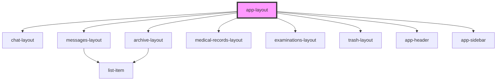

# app-layout

<!-- Auto Generated Below -->

## Dependencies

### Depends on

- [chat-layout](../chat-layout)
- [messages-layout](../messages-layout)
- [archive-layout](../archive-layout)
- [medical-records-layout](../medical-records-layout)
- [examinations-layout](../examinations-layout)
- [trash-layout](../trash-layout)
- [app-header](../app-header)
- [app-sidebar](../app-sidebar)

### Graph

----------------------------------------------

*Built with [StencilJS](https://stenciljs.com/)*
