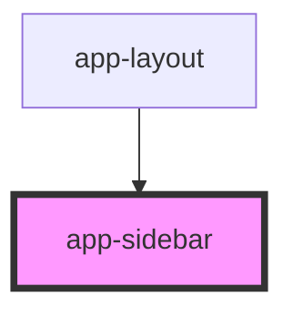

# app-sidebar

<!-- Auto Generated Below -->

## Properties

| Property       | Attribute       | Description | Type                                                                        | Default      |
| -------------- | --------------- | ----------- | --------------------------------------------------------------------------- | ------------ |
| `activeLayout` | `active-layout` |             | `"archive" \| "examinations" \| "medical-records" \| "messages" \| "trash"` | `'messages'` |

## Events

| Event          | Description | Type                                                                                     |
| -------------- | ----------- | ---------------------------------------------------------------------------------------- |
| `layoutSelect` |             | `CustomEvent<"archive" \| "examinations" \| "medical-records" \| "messages" \| "trash">` |

## Dependencies

### Used by

 - [app-layout](../app-layout)

### Graph

----------------------------------------------

*Built with [StencilJS](https://stenciljs.com/)*
