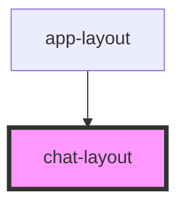

# chat-layout

<!-- Auto Generated Below -->

## Properties

| Property  | Attribute | Description                           | Type          | Default |
| --------- | --------- | ------------------------------------- | ------------- | ------- |
| `contact` | --        | Kontakt (pacient) – z messages-layout | `ChatContact` | `null`  |

## Events

| Event  | Description | Type                |
| ------ | ----------- | ------------------- |
| `back` |             | `CustomEvent<void>` |

## Dependencies

### Used by

 - [app-layout](../app-layout)

### Graph

----------------------------------------------

*Built with [StencilJS](https://stenciljs.com/)*
