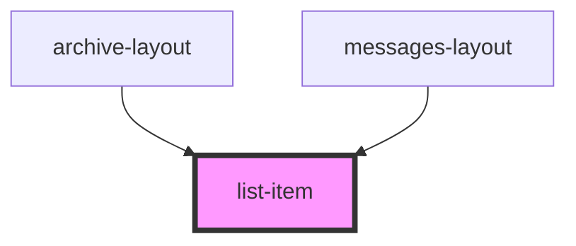

# list-item

<!-- Auto Generated Below -->

## Properties

| Property    | Attribute    | Description | Type                                         | Default                          |
| ----------- | ------------ | ----------- | -------------------------------------------- | -------------------------------- |
| `chipLabel` | `chip-label` |             | `string`                                     | `'Active'`                       |
| `name`      | `name`       |             | `string`                                     | `'John Doe'`                     |
| `status`    | `status`     |             | `"ARCHIVED" \| "NEW" \| "READ" \| "REVOKED"` | `'NEW'`                          |
| `text`      | `text`       |             | `string`                                     | `'Nová správa od kontaktu ... '` |

## Dependencies

### Used by

 - [archive-layout](../archive-layout)
 - [messages-layout](../messages-layout)

### Graph

----------------------------------------------

*Built with [StencilJS](https://stenciljs.com/)*
